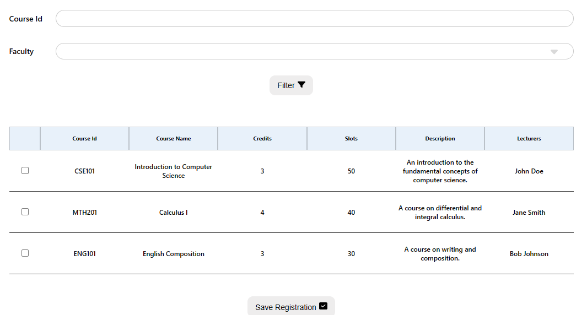

<h1>USAGE</h1>

**By default, all requests require the `student_id`. Additional parameters will be mentioned seperately.**
<h2>Course Registration</h2>

### ✅ **GET**

> Input: `Course ID` (String), `Faculty` (String)

> Return: List of Courses
> - `Course ID`
> - `Course Name`
> - `Credits`
> - `Slots`
> - `Description`
> - `Lecturers Name`

<h2>Time Table</h2>

### ✅ **GET**
> Input: `Semester` (String), `Week` (Number)

> Return: List of Classes
> - `Course ID`
> - `Course Name`
> - `Credits`
> - `Slots`
> - `Description`
> - `Lecturers Name`
> - `Day Of Week`: "Mon", "Tue",...
> - `Start`
> - `Duration`

<h2>Examination Schedule</h2>

### ✅ **GET**
> Input: `Semester` (String), `Examination` (String) <"midterm", "final">

> Return: List of Exams
> - `Course ID`
> - `Course Name`
> - `Exam Date`
> - `Start Hour`
> - `Room`

<h2>School Fee</h2>

### ✅ **GET**
> Input: `Semester` (String), `Examination` (String) <"midterm", "final">

> Return: List of Fees
> - `Semester`
> - `Tuition`
> - `Exemption`
> - `Receivable`
> - `Collected`
> - `Owe`

> Return: Collection of total
> - `sum_tuition`
> - `sum_excemption`
> - `sum_collected`
> - `sum_owe`

<h2>Course Program</h2>

### ✅ **GET**

> Return: All of required Programs
> - `Course Id`
> - `Course Name`
> - `Credits`
> - `Semester`
> - `Elective`
> - `Learnt`